# 👨‍💻 SSAFY FINANCE OPEN API
**마이데이터 규격에 맞게 금융 데이터를 제공하는 OPEN API**  

**목표 : 다양한 금융 데이터를 제공하는 OPEN API**

1. OAuth 2.0 사용자 인증

 - 개인신용정보 전송요구에 OAuth2.0 방식 채택 

2. 개인 카드목록 조회 & 카드 사용내역 조회 API

 - 개인 카드 사용내역을 통한 소비패턴 분석

3. 한 눈에 보는 나의 투자정보 API

 - 증권사 별, 계좌 별로 흩어져 있는 나의 투자내역를 한 번에 조회할 수 있는 서비스

4. 환율 API

 - 실시간 은행별, 나라별 환율 정보 제공

  

## 📅프로젝트 기간

**23.08.28 ~ 23.10.06 (6주간)**

## 🧝‍♂️팀원 및 역할

| **팀장** | 홍유빈 (BE : OAuth 2.0, docs API)   |
|----------|---------------------|
| **팀원** | 강현곤 (FE 총괄 )             |
| **팀원** | 권기연 (BE : 개인 카드 목록 조회 및 카드 사용 내역 조회 API, FE : API 문서 웹페이지 화면 구현)  |
| **팀원** | 김하영 (BE : 환율 API, 소비내역 분석 API, 카드 사용 내역 샤딩 )  |
| **팀원** | 이진호 (BE : 한 눈에 보는 나의 투자정보 API )     |
| **팀원** | 정형준 (Infra) |

## 👨‍👩‍👧협업 툴

- GitLab
- Jira
- Notion
- Mattermost

## 🛠️주요 기능

1. API 문서

 

2. Oauth2.0 인증 과정 소개

 

3. URI 등록

 

4. 서비스 사용 예시 - 환율

 

5. 서비스 사용 예시 - 금융 더미 데이터

 

## 🖥️ 개발 환경

🖱**Backend**

- IntelliJ
- spring boot 2.7.15
- spring-boot-jpa
- Spring Security
- Java 11

🖱**Backend**

- mysql 8.0.23
- Redis 7.2.1
- MongoDB Cloud

🖱**Frontend**

- Visual Studio Code
- React.js 18.2.0
- node.js 18.16.1
- axios 1.4.0
- styled-components 6.0.4

🖱**CI/CD**

- AWS EC2
- docker
- nginx
- jenkins

## 🔧 서비스 아키텍쳐

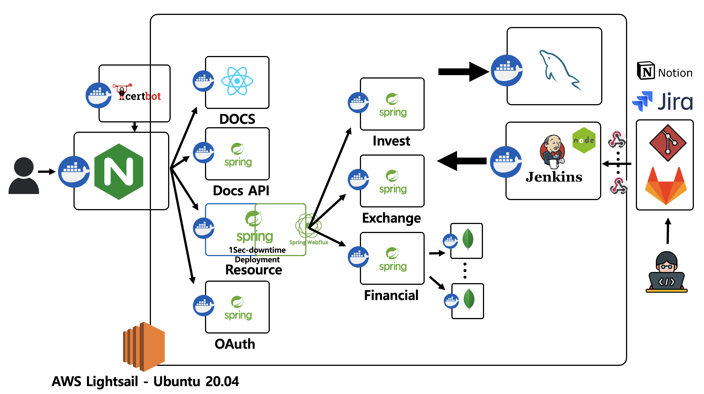

## 📑 API 명세서

API

 
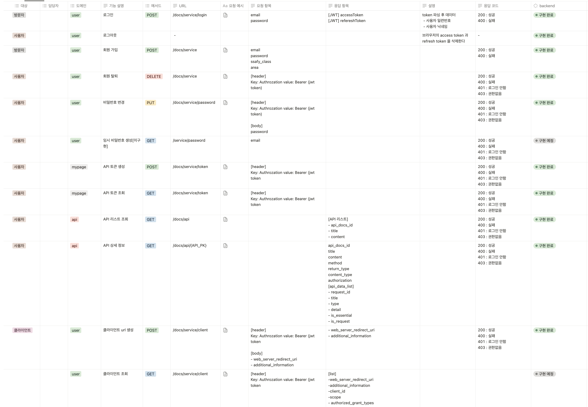
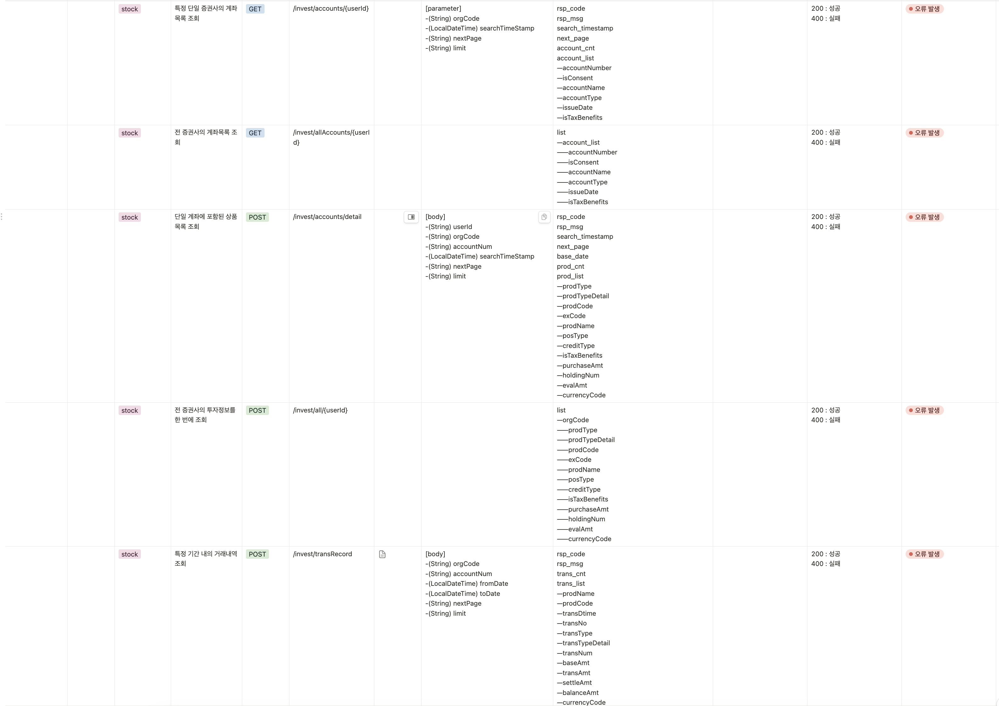
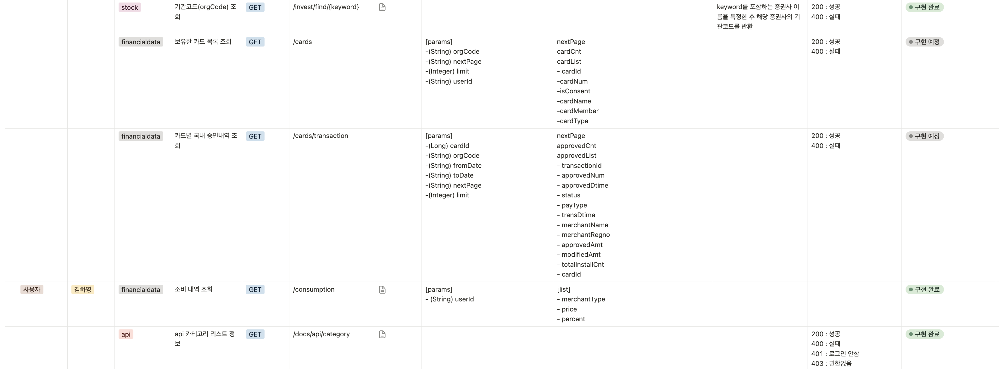

## ✨ERD

ERD

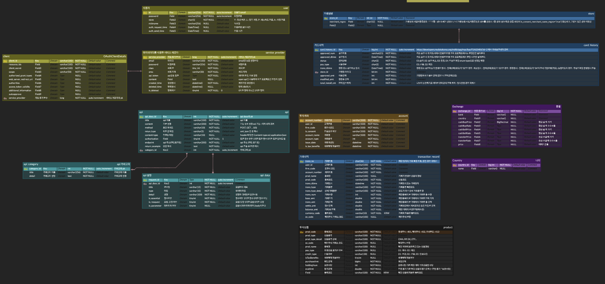
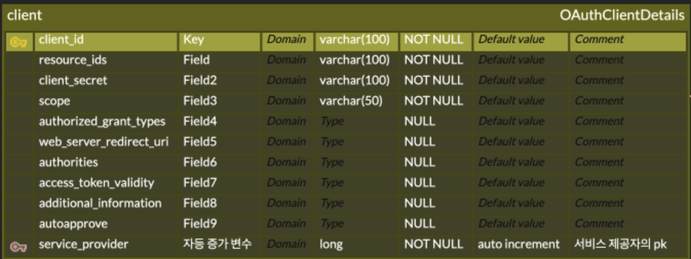

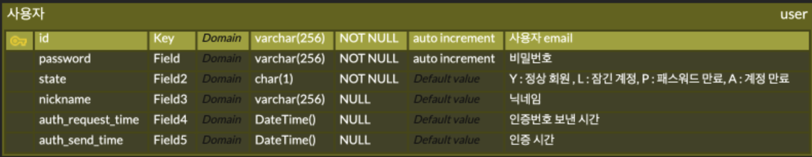
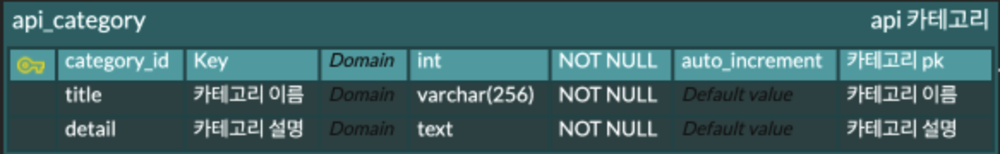
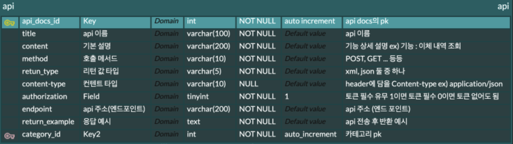
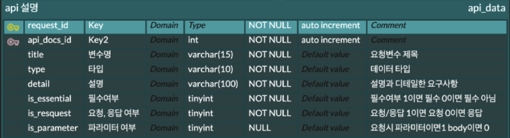
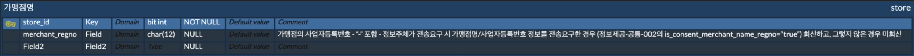

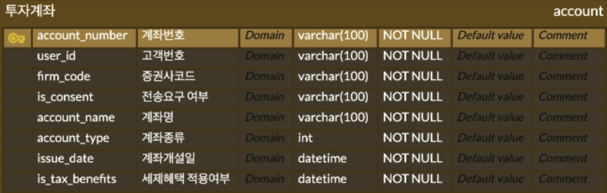
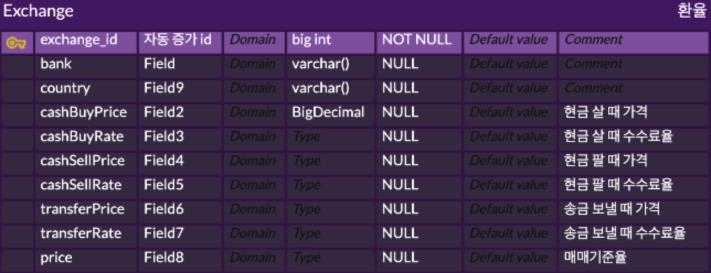

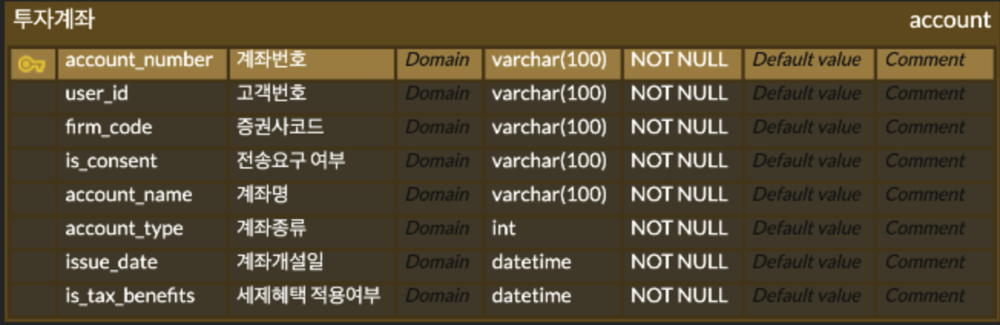
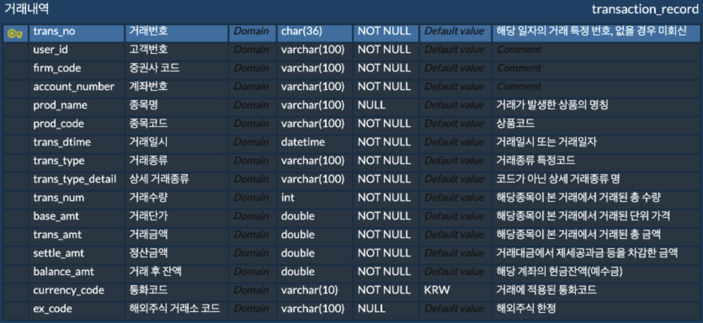
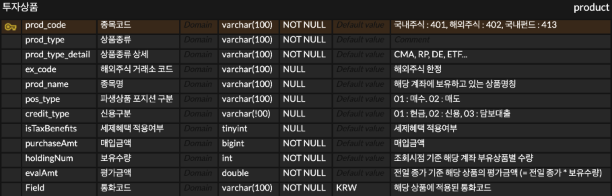

## 📚 커밋 컨벤션 규칙

| Type 키워드 | 사용 시점 |
| --- | --- |
| 첫 커밋 | CREATE: start project |
| Add | 새로운 파일 추가 |
| Delete | 파일 삭제 |
| Feat | 새로운 기능 추가, 기존의 기능을 요구 사항에 맞추어 수정 |
| Fix | 기능에 대한 버그 수정 |
| Build | 빌드 관련 수정 |
| Chore | 패키지 매니저 수정, 그 외 기타 수정 ex) .gitignore |
| Ci | CI 관련 설정 수정 |
| Docs | 문서(주석) 수정 |
| Style | 코드 스타일, 포맷팅에 대한 수정 |
| Refactor | 기능의 변화가 아닌 코드 리팩터링 ex) 변수 이름 변경 |
| Test | 테스트 코드 추가/수정 |
| Release | 버전 릴리즈 |
| Rename | 파일 혹은 폴더명을 수정만 한 경우 |
| Readme | README |
| Comment | 주석관련 |

 ***commit message***
  - commit은 최대한 자세히

`키워드(대문자) :  (영어로 위치/함수/기능) + 설명`

## 🌐EC2 PORT

| 서비스                 | 포트  |
|-----------------------|-------|
| Spring Boot: Stock    | 8082  |
| Spring Boot: FinancialData | 8083  |
| Spring Boot: Exchange | 8084  |
| Spring Boot: Oauth    | 8087  |
| Spring Boot: Resource | 8088  |
| Spring Boot: Security | 8089  |
| React                 | 3000  |
| MySQL                 | 3306  |
| Jenkins               | 9090  |

